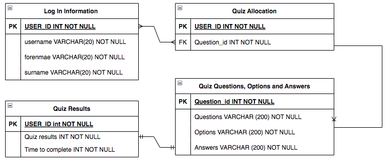
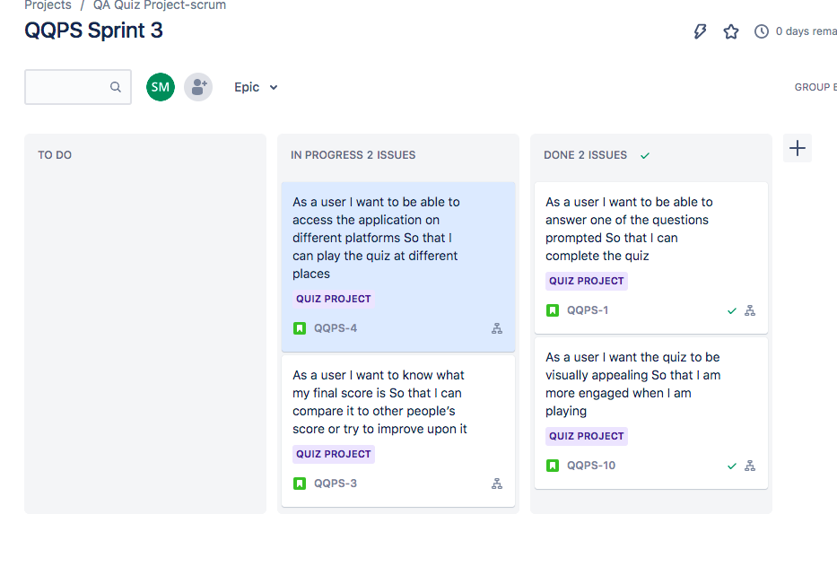
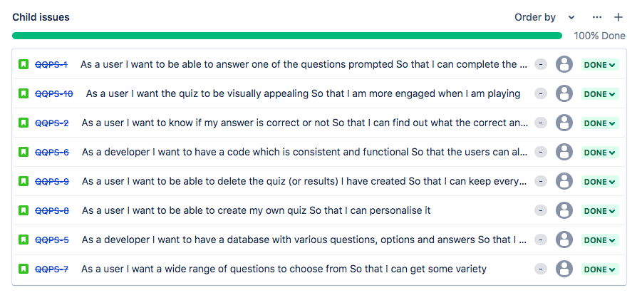

# QA-DevOps-Fundamental-Project. Quiz app:
This repository consits of the code necessary to run a simple CRUD (create, read, update and delete) Quiz application

# Contents:
Project Brief

App Design

CI Pipeline

Risk Assessment

Testing

The Application

Updates

Known Issues

Future Work

# Project Brief:
The scope of this project was to design a web application. It was required that the project be carefully planned, with the use of a Trello or Kanban board. The app needs to have a minimum of two relational databases to store data and have the data from one table interact with the other. This application needed to incorperate CRUD functionality, which allows for date to be created, read, updated and deleted. Additionally extensive testing is required in order to validate the application. The application is also required to have a functioning front-end website

# App Design:
The appication which I chose to create was that of a quiz app. Through the app the user is able to:

Create their own questions, options and answers.

Read the questions which have been created and answer them by selecting one of the four options provided. Additionally they are able to read how many questions are present within the database.

Update the questions by choosing to change the question, answer and/or the various options.

Delete the questions from within the database.

The databases used for the application were first designed using an ERD diagram as seen below.

The tables include:

Log In Information, the purpose of which was to allow for users to create an account and store their data.

Quiz Allocation, allowing for questions to be assigned to each different user.

Quiz Questions, Options and Answers, to store of the different questions, options and answers created by the various users.

Results, allowing users to track their score and progress

The relationships and the contents between the databases were slightly altered to allow for the app to function better. The Log In Information database initially only connected to the Quiz Allocation database although later a relationship was made with the Results database. Furthermore, some primary and foreign keys were added.

# CI Pipeline
A Trello board was used to track the progress of the project, as part of this Trello board a user epic was devloped, consisting of series of user stories. This was done in order to better articulate what needed to be completed for the project to be deemed successful. These user stories were made up of child issues which broke down what needed to be done into specific tasks.

The user stories were periodically moved from the backlog into a sprint based on what could be done within the given timeframes of the respective sprints. The tasks were moved around throughout the sprint board depending on their status, as seen below.

As seen below, all but two of the user stories were completed within the timeframe of the project. The reson why two were not completed is because they fell outsied of the scope of the project.

