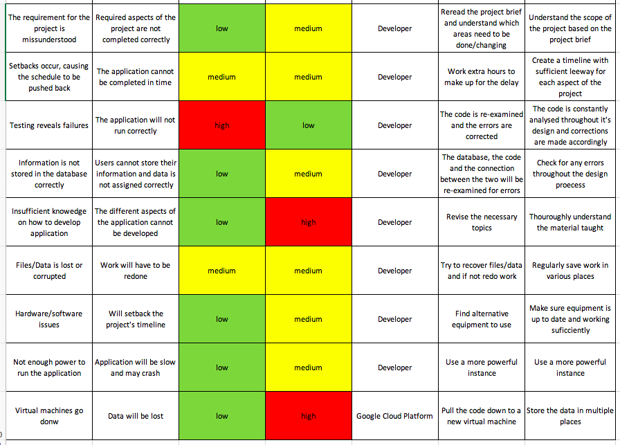
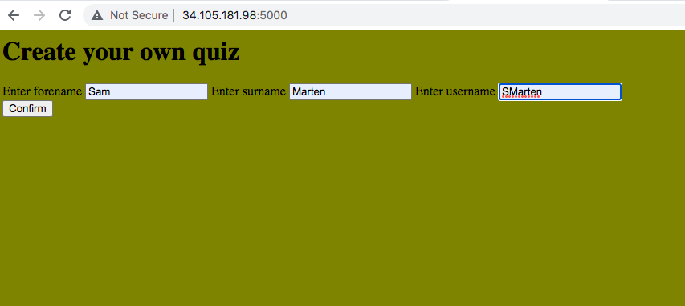
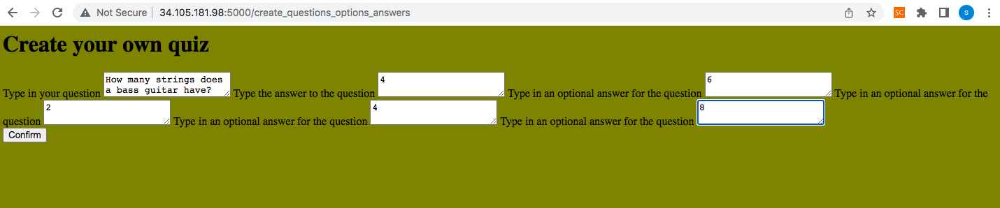
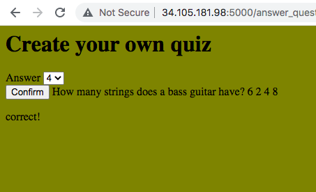
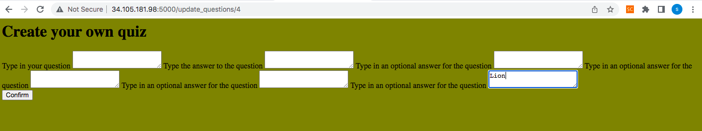
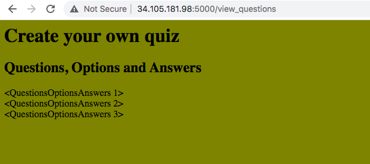
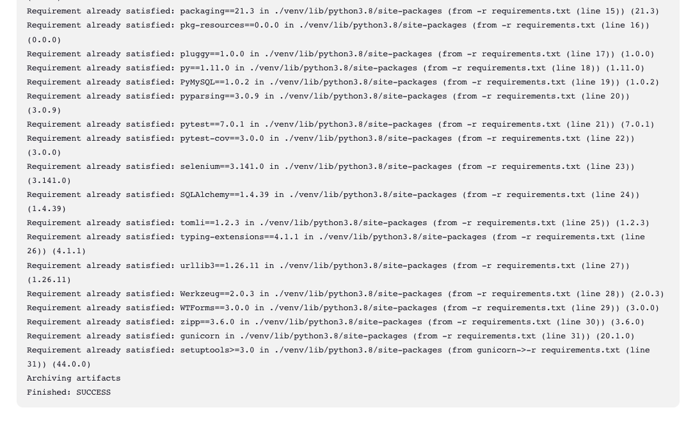
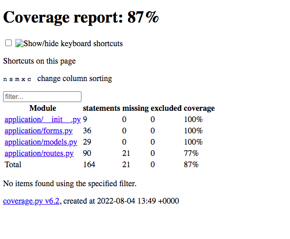

# QA-DevOps-Fundamental-Project. Quiz app:
This repository consits of the code necessary to run a simple CRUD (create, read, update and delete) Quiz application

# Contents:
Project Brief

Task Allocation/Tracking

App Design

Risk Assessment

The Application

Testing

Future Work

# Project Brief:
The scope of this project was to design a web application. It was required that the project be carefully planned, with the use of a Trello or Kanban board. The app needs to have a minimum of two relational databases to store data and have the data from one table interact with the other. This application needed to incorperate CRUD functionality, which allows for date to be created, read, updated and deleted. Additionally extensive testing is required in order to validate the application. The application is also required to have a functioning front-end website

# Task Allocation/Tracking
A Trello board was used to track the progress of the project, as part of this Trello board a user epic was devloped, consisting of series of user stories. This was done in order to better articulate what needed to be completed for the project to be deemed successful. These user stories were made up of child issues which broke down what needed to be done into specific tasks.

The user stories were periodically moved from the backlog into a sprint based on what could be done within the given timeframes of the respective sprints. The tasks were moved around throughout the sprint board depending on their status, as seen below.

As seen below, all but two of the user stories were completed within the timeframe of the project. The reson why two were not completed is because they fell outsied of the scope of the project.

# App Design:
The appication which I chose to create was that of a quiz app. Through the app the user is able to:

Create their own questions, options and answers.

Read the questions which have been created and answer them by selecting one of the four options provided. Additionally they are able to read how many questions are present within the database.

Update the questions by choosing to change the question, answer and/or the various options.

Delete the questions from within the database.

The databases used for the application were first designed using an ERD diagram as seen below.

The tables include:

Log In Information, the purpose of which was to allow for users to create an account and store their data.

Quiz Allocation, allowing for questions to be assigned to each different user.

Quiz Questions, Options and Answers, to store of the different questions, options and answers created by the various users.

Results, allowing users to track their score and progress

The relationships and the contents between the databases were slightly altered to allow for the app to function better. The Log In Information database initially only connected to the Quiz Allocation database although later a relationship was made with the Results database. Furthermore, some primary and foreign keys were added.

# Risk Assessment:
In order to identify any risks which could arrise throughout the project a risk assessment was conducted. By doing so problems could be predicted and mitigated through various actions. 
The severity of the risks was determined in order to find the risks which posed the highest threat. This allowed for the largest risks to be prioritised.

The following risks did occur throughout the project; 'Setbacks occur, causing the schedule to be pushed back' and 'Testing reveals failures'. Because these risks were anticipated, the setbacks did not cause a significant delay to the project and the failures found throughout the testing were minor and quickly fixed.

# The Application
The application itself is created using flask. Flask is a micro web framework written in python, this framework makes the development of web applications simpler.

The first page the user is taken to is the login page, where they are able to enter their forename, surname and username.

Once a user has provided their login infomation they will be taken to the create question, options and answers page. This page allows for the user to create any question they wish, provide an answer to the question and provide a series of options for a user to chose from,

Once the question, options and answers has been created, the user will be redirected to the answer questions page, where they will be able to answer the question which had been created from a drop down menu. Different questions can be answered by providing a different question id, each question has a respective question id.

If a user wishes to change their question and/or the respective options and answer they are able to through the update questions page. The user will be able to specify which question they want to alter by specifying the question id in the url.

All of the questions created can be viewed the view questions page, as seen below.

Lastly the questions can be deleted, the delete function does not have a html page, although once a question is deleted the user will be redirected to the view questions page. To chose which question is to be deleted the question id number needs to be provided.

# Testing
Unit testing was conducted in order to test the various functions within the app.
Jenkins was used in order to automate the process, making it so that every time the code was pushed a new build would initiate. The finalised code was tested and proven to be successful as shown with the image below.

Jenkins also provided the percentage of the statements included within the tests. The tests concluded that 87% of the statements were included within the test. The reason for this was because not all of the routes were utilised in the application. Initially there was to be 8 routes which had different purposes. Instead 6 routes were utilised, these being the Login_page, create_questions_options_answers, view_questions, answer_question, update_questions and the delete_questions routes. These routes provided the neccessary CRUD functionality.

# Future Work
In the future I would like to incorporate various additional functions to the quiz. Mostly I would like for the quiz to incorperate a tracking feature, this would allow for the progress of users to be tracked, compiling the number of correct and incorrect answers. Through this users will be able to compare their scores with others. Another feature to add would be the ability for the user to catagorise their quiz questions.
